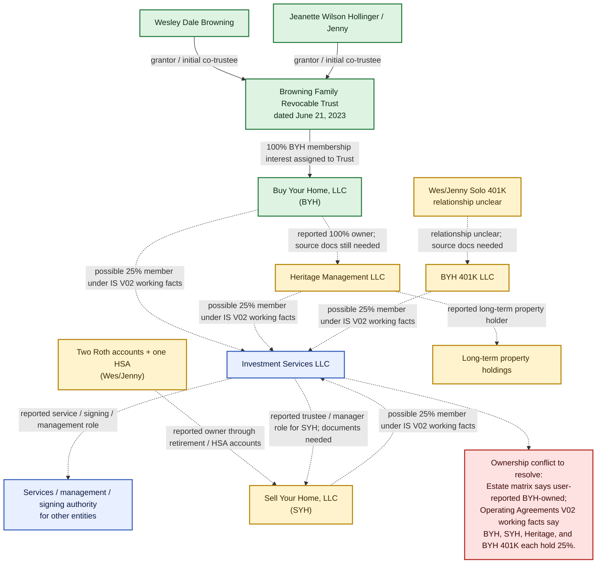

# Entity Relationship Chart

Status: review draft, not legal or tax advice.

This chart separates source-backed relationships from user-reported or working-draft relationships.

## Legend

- Solid line: supported by copied estate documents or current project-room summaries.
- Dashed line: user-reported, draft, or needs source confirmation.
- Conflict marker: current sources do not all say the same thing.

## Formal Relationship Diagram

## SVG Version

For a shareable graphic file, see:

`C:\Codex\Wiki Files\Project Rooms\Estate Documents\outputs\entity-relationship-chart.svg`

## Source Notes

### Source-backed

- The estate summary says the Buy Your Home, LLC assignment transferred 100% of BYH membership interest from Wes and Jeanette/Jenny to the Browning Family Revocable Trust dated June 21, 2023.
- The estate summary identifies Wes and Jeanette/Jenny as trust grantors and initial co-trustees.

### User-reported / needs confirmation

- Heritage Management LLC is reported as wholly owned by BYH and as holding long-term property.
- Sell Your Home, LLC is reported as owned through two Roth accounts and one HSA belonging to Wes and Jenny.
- BYH 401K LLC is reported as related to Wes and Jenny's Solo 401K, but the ownership direction is unclear.
- Investment Services LLC is reported as providing services, signing authority, and management/trustee functions.

### Conflict to resolve

- `Project Rooms\Estate Documents\outputs\entity-estate-review-matrix.md` records Investment Services LLC as user-reported BYH-owned.
- `Project Rooms\Operating Agreements\working\Investment Services\README.md` records current V02 working facts that Investment Services LLC members are Buy Your Home, LLC; Sell Your Home, LLC; Heritage Management LLC; and BYH 401K LLC, each with 25%.

Before using this chart with an attorney, lender, title company, or CPA, confirm the current operating agreements, membership ledgers, resolutions, account-owned LLC records, beneficiary designations, and signing-authority documents.
