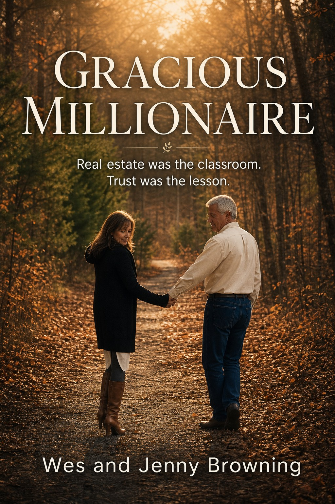

# Gracious Millionaire - Rewrite Mode v27 - Interview-Informed Whole Manuscript

## Linkable Section Outline

1. [Foreword: What This Rewrite Is](#section-01)
2. [The Question Under The Money](#section-02)
3. [Jenny's Safe Way](#section-03)
4. [Jenny's First Houses](#section-04)
5. [Jenny's Beach Condo And The Long Wait](#section-05)
6. [Jenny's Coastal Surrender](#section-06)
7. [Failure Before Favor](#section-07)
8. [Always God Is There](#section-08)
9. [Convergence And The Systems Thread](#section-09)
10. [Technology On Top Of Order](#section-10)
11. [The First Classrooms](#section-11)
12. [Private Money And Entrusted Trust](#section-12)
13. [Favor And Assignment](#section-13)
14. [Red Quartz And The Speed Of Blessing](#section-14)
15. [Leadership Or The Lack Of](#section-15)
16. [Providence Landing: Discovery And The Weight Of Vision](#section-16)
17. [Providence Landing: The Business Review](#section-17)
18. [Providence Landing: Letting Go](#section-18)
19. [Rosebrooks: Mercy Under Accusation](#section-19)
20. [The Orphaned Property](#section-20)
21. [Leadership, Patience, And Waiting With Jenny](#section-21)
22. [Abundance Under Lordship](#section-22)
23. [Gratitude Before Complaint](#section-23)
24. [Tribes And Work Worth Joining](#section-24)
25. [Closing: Lessons Still Unfinished](#section-25)

---

## Foreword: What This Rewrite Is

This manuscript is an AI-generated Rewrite mode version of *Gracious Millionaire*, generated by GPT-5 from the Gracious Millionaire project-room materials, Wes and Jenny's book sources, the latest Interview mode manuscript, and the current project-room writing and fact notes. It is not a verbatim transcript of an interview or a final edited book.

This pass follows the new operating rule for the book: new subject material is first tested in Interview mode, where Jean can ask active, emotionally intelligent questions, and then moved through Rewrite mode so the whole manuscript is reconsidered. That matters here because Jenny's latest coastal-surrender material should not remain a local insertion. It changes the whole book. It changes how safety, caution, grief, waiting, and surrender are understood before the later property stories begin.

The governing question remains the old question: How much money is too much money?

It is not an amount. It is when the desire for money replaces trust in God.

Real estate is still the classroom. Houses, foreclosure files, loans, title problems, spreadsheets, contractors, private lenders, investors, lawsuits, buyers, tenants, and unfinished trades still keep the story concrete. But the subject is not real estate technique. The subject is formation. The subject is what increase does to the heart, what pressure does to a marriage, what opportunity does to patience, and what favor requires from a person who is still learning lordship.

This rewrite therefore tries to make every chapter answer two questions. First: what happened? Second: what lesson is visible here that is not yet fully learned?

Some chapters carry Wes's voice more strongly. Some carry Jenny's. Some now belong to both of them because Jenny's perspective changes the meaning of Wes's earlier interpretation. The book is strongest when it does not pretend that agreement is automatic, that caution is unbelief, or that profit is proof. It is strongest when it lets a deal remain unfinished, a question remain live, and a marriage become part of the classroom.

## The Question Under The Money

The title *Gracious Millionaire* sounds as though the book is about money. That is unavoidable. Jenny and I have experienced measurable increase. We started our married life with debt, stress, and negative net worth, and the Lord has allowed us to build a real estate business that has changed our financial condition. It would be false humility to pretend otherwise.

But a book about money can become dangerous if money is allowed to become the point.

The first question is not, how did we make it? The first question is, what did it become in us? Did it serve the assignment God gave us, or did it begin to replace our trust in Him? That question can expose a wealthy person, but it can also expose a person with very little. Money does not have to be large to become a lord. It only has to become the thing that tells us whether we are safe, whether we are valuable, whether we can obey, and whether God is enough.

That is why I do not want this to be a prosperity manual. I do not want to write a book that teaches people how to use spiritual language to get rich. I want to tell the truth about what happened as real estate, favor, education, mistakes, systems, risk, marriage, prayer, and money came together.

Favor is central to the story, but favor is not a trick. I learned the definition from Lance: favor is the attraction of God to you that releases an influence through you so other people are inclined to like, trust, and cooperate with you in the assignment God gave you. That definition has weight because it keeps favor tied to assignment. It is not charm. It is not manipulation. It is not a formula for making sellers say yes.

The Kingdom touches every aspect of life, including finances. But the Kingdom begins within. All Kingdom issues are heart issues. All heart issues become lordship issues. That is why the lessons in this book are not cleanly separated into business lessons and spiritual lessons. In my life, they have not arrived separately.

A seller's kitchen table became a classroom. A foreclosure file became a test. A private lender's trust became stewardship. Jenny's hesitation became a mirror. A stalled trade became a leadership lesson. A lawsuit became a question about graciousness under accusation. Providence Landing became a warning that vision can grow heavier than the family asked to carry it.

The question under the money is still the question under the book: who is Lord?

## Jenny's Safe Way

Jenny's voice has changed this manuscript because her caution now has history behind it.

If I describe Jenny only as the one who slows me down, I misrepresent her. She is not caution as a mood. She is caution formed by experience. She likes things that are researched, proven, organized, predictable, balanced, honest, calculable, and safe. She prefers the path that can be understood before it is entered. She wants integrity in the details and peace in the home after the decision is made.

That is not the opposite of faith. It may often be one of the ways wisdom enters the room.

My natural instinct is to see possibility quickly. I see a structure, a path, a spreadsheet, a solution, or a sequence of transactions. I can imagine how a problem becomes an offer and how an offer becomes a deal. That is one of the strengths God has used in our business. But the same strength can become a weakness when it runs ahead of peace.

Jenny tends to feel the weight of a decision before I do. She may be thinking about repairs, people, management, safety, debt, our home, our time, or the emotional atmosphere that will follow the decision. I may be looking at the upside. She may be looking at what the upside will require.

Earlier versions of this book often used Jenny's caution as a point of tension inside my story. That was true, but incomplete. Her own real estate history shows why caution belongs in the book as its own witness. She bought property the conventional way. She carried mortgages and family pressure. She invested proceeds into a beach condo and learned that a good-looking investment can still become a burden. She waited through 2008 while the market collapsed and fear pressed in.

Then, after a second marriage ended abruptly, the South Carolina coast became more than an investment location. It became the geography of escape, despair, intervention, and surrender.

Once that is understood, the later disagreement about the Orphaned Property cannot be reduced to Jenny not liking a deal. Her caution carries memory. It carries grief. It carries a lived understanding that a property may look profitable and still be too heavy for the person who has to live with it.

The gracious millionaire has to learn to hear that voice.

## Jenny's First Houses

Jenny's first experience with real estate began in the most understandable way possible. In 1978, in Northern Virginia, she and Number One wanted to own a home. They were young. They were newly married. They worked two jobs each, saved for a down payment, and bought a small starter house for $37,000 with a conventional bank loan and a thirty-year mortgage.

That house represented responsibility. It represented something that could be planned, afforded, and understood. It was not a creative transaction. It was not a foreclosure rescue. It was not private money, subject-to, or seller financing. It was the path Jenny understood: work, save, qualify, borrow, pay, and build a stable life.

Then the family changed. Jenny left full-time employment after their first child was born. Twin girls came twenty-three months later. Suddenly the starter house and the family car no longer fit the life they were living. They bought a larger new house and a used van. The mortgage was bigger. Interest rates were high. There were three babies under two. The household carried debt, exhaustion, and the pressure of trying to make everything work.

This matters because finances were never abstract for Jenny. A mortgage lived in the kitchen. A car payment lived in the marriage. A debt cycle could become a climate in the home. When bills fell behind and caught up and fell behind again, the stress was not only financial. It was relational.

The marriage eventually ended after twenty-five years. Jenny does not need this book to explain every part of that marriage. But it does need to honor what that season taught her. Houses can be shelters, but they can also carry strain. A decision can be reasonable on the day it is made and still test the family for years afterward. Security is not only the ability to buy. Security is the ability to carry what has been bought without losing the peace of the people inside it.

That lesson was not learned in a real estate seminar. It was learned in years of diapers, debt, family responsibility, mortgage pressure, and the end of a marriage Jenny never expected to lose.

When she later asks whether one of our projects is safe, she is not asking a small question. She is asking from history.

## Jenny's Beach Condo And The Long Wait

After moving to Raleigh in 2002, Jenny took proceeds from the home sale and invested much of it in an oceanfront condo in Garden City Beach. She did what fit her nature. She calculated rents, HOA fees, insurance, management costs, and mortgage payments. She hired an on-site management company. She did her homework. The first summer rentals paid an entire year of mortgage payments, and the investment appeared to be working.

Then the numbers changed.

HOA dues and assessments increased. The rental income still covered the mortgage, but the other costs pushed the property into the red. Jenny remodeled the condo and listed it for sale in 2008, just as the real estate market collapsed. Anyone who understands real estate remembers what that year meant. It was a good time to buy, not a good time to sell, and Jenny needed to sell.

This was not a season of advanced strategy. She did not yet have the education, experience, or confidence that she has now. She did not have our later business systems. She was not analyzing a portfolio of options. She was waiting, praying, and trying not to be swallowed by fear while a condo sat with no showings and no offers.

There is a kind of waiting that is not passive. It is active surrender. It is the daily refusal to let fear become lord while nothing visible is changing.

The provision came through an ordinary relationship. A woman in the building who cleaned for Jenny also knew other absentee owners. She told someone about the condo. Just like that, a buyer appeared. It was not dramatic in appearance, but it was mercy in motion.

This chapter belongs before the later stories of fast favor because it teaches a different rhythm. Red Quartz moved in days. The condo sat in the pressure of a collapsed market. Both can be stories of God's provision. The difference is that one teaches the joy of speed and the other teaches the humility of waiting.

Jenny's correction about Number Two also belongs here. He was in the same general time frame as the condo ownership, but he was not personally invested in the condo. That matters because this is Jenny's real estate story. Its weight should not be shifted to someone who did not carry that investment.

Waiting through 2008 did not make Jenny timid. It made her attentive to weight. It taught her that a property can look safe until conditions change, and then only trust remains.

## Jenny's Coastal Surrender

Several years after moving to North Carolina, and after buying the beach condo, Jenny remarried. She genuinely believed it would be forever. That matters because her later grief was not simply disappointment. It was the collapse of a future she had trusted.

The marriage ended abruptly, almost before it began. Jenny described it as amazingly great and amazingly horrible. She came away with raw emptiness, a huge sense of failure, and a severe judgment against herself. A person who had always valued caution looked back and wondered how she had missed what she believed she should have seen. The wound was not only heartbreak. It was a wound in her confidence that she could trust her own judgment.

She wanted to run from the pain, the gossip, the reminders, and the threats that made her fear for her safety. Her grown children were away at college in three different states. Northern Virginia felt too expensive and too cold to return to. The South Carolina coast, familiar from the beach condo and from earlier vacations, seemed like a place where she might begin again. The plan was simple: go to the condo in the off-season, find a place to rent inland, and start over.

But doors closed. One rental possibility after another disappeared. Her seventy-pound poodle was often part of the rejection, but the deeper result was the same: no place opened. After three days of searching, Jenny sat on the sofa, opened her laptop one more time, and watched it fall to the tile floor. The screen scrambled. It felt like the last practical thing she had left had broken.

In that moment, despair became dangerous. She cried out to the Lord. Then the phone rang.

Linda, the only person Jenny knew in the area, called at ten o'clock at night and immediately sensed that something was wrong. Jenny tried to sound fine. Linda did not accept that answer. She came over, stayed with her, helped restore the laptop through her husband, and reassured Jenny that things would turn.

The next morning Jenny packed the car and began driving back toward Raleigh with no answer. As she reached the edge of the coastal area, a management company called. They had several condos she could choose from. She turned around, drove to Pawleys Island, took the poodle into the office as part of the package, received keys, toured brand-new condos, applied, and was accepted to move in immediately.

The relief was beyond words.

This is not only a relocation story. It is a surrender story. Jenny let go of the stronghold of fixing it herself. She became more dependent on the Lord than she had ever been. He was there the whole time. She had to stop and let go.

That sentence now reaches forward into the rest of the book. Wes also has strongholds. He can grip an outcome, a deal, a vision, a spreadsheet, or a plan. Jenny's coastal surrender shows the book what letting go can look like before Providence Landing or the Orphaned Property ever ask the same thing of him.

## Failure Before Favor

It would be dishonest to write about success in real estate as though success were the first chapter.

Before Jenny and I built the business we have now, real estate had already been present in my life as both desire and loss. I bought a house in Florida with my first wife. I was self-employed in the sign business and built a garage shop behind the house. When I felt my life was not moving in the direction I wanted, we deeded the house to her parents, moved in with them, and I started college full time at thirty. Later we moved to Gainesville, and eventually to North Carolina, where I continued developing in computer programming even though my original degree path did not finish the way I imagined.

Real estate appeared again in a little farmhouse in Johnston County. That house became a symbol of loss. I lost it once in the first divorce, bought it back from the person who had bought it, then lost it again in the second divorce. Real estate had not been my friend at that point in my life.

During the second marriage, there were three major real estate transactions that failed. One was a Raleigh home with a finished main level and an unfinished basement. We renovated the lower level so the family could live downstairs and rent the upstairs, creating a model where the house could nearly pay for itself. The idea was sound. The outcome still became entangled in the larger failure of the season.

The second was a large rundown hotel near the Houston-Galveston corridor, with rooms, a restaurant, a bar, and conference space. We moved into one of the suites and tried to bring the property back to life. It was exciting. It was also consuming. The hotel never made money, and the financial pressure added to the pressure already building in the marriage.

The third was five duplexes in Johnston County, occupied by Section 8 tenants. For a while they cash flowed. Then vacancies, management burden, loan pressure, divorce, and the 2008 crisis overtook the effort. One by one, the banks foreclosed.

I do not know what would have happened if I had known then what I know now. I cannot honestly say that a deeper walk with the Lord would have changed every outcome. There were other dynamics in the marriage and in my decisions. But I can say that I was not walking in favor the way I am trying to describe it now. I was not daily depending on God's help, asking for His favor, and submitting my ambitions to His lordship.

Failure belongs in the book because it keeps favor from becoming self-congratulation. The difference between then and now is not that I became smarter and therefore deserved success. The difference I can recognize is that now I am trying to walk under the favor and leadership of the Lord.

Even that sentence is not a trophy. It is a lesson still being learned.

## Always God Is There

A song on the radio can open a door in memory.

I was driving to a job site when "Nights in White Satin" came on, and the swelling music took me back nearly fifty years. I was young, driving a truck with the volume high, leaving my parents' home in Lutz. The road crossed a railroad track before it met the highway. I looked left too late and saw the train coming. The horn had been blowing, but the music had covered it.

I floored it and almost made it.

The train caught the back of the truck, spun it around, and threw me hard into the door. The truck was totaled. I walked away with little more than a bruised arm.

That was not the first accident, and it was not the last. There was another late-night wreck near the same area when I dozed off and woke up just in time to avoid a utility pole. There was the repaired truck later being totaled again when another car crossed into my lane. There was a BMW incident on the interstate where a man ran me off the road, I spun into the median wires, and came away alive. There was the more recent Escalade wreck near our house, captured by dash cams, where another car crossed the line and tore up the vehicle while I walked around looking at the damage and called Jenny to pick me up.

I am not telling these stories to glorify carelessness. Some of my younger driving was foolish. A good driver would have slowed at the tracks. A wise man does not use mercy as an excuse to keep being reckless.

But I cannot tell the truth without saying that God has protected me again and again.

That protection is part of the same story as favor in business. Not because God endorses every risky thing I do, and not because I should take credit for walking away from danger. The point is the opposite. I have been spared in ways that remind me not to take credit for what someone else has done.

Always God is there.

That phrase can become sentimental if it is not grounded in real memories. For me, it is grounded in crushed vehicles, phone calls to Jenny, bent metal, broken plans, and the strange mercy of walking away.

The lesson still unfinished is caution. I can testify about protection more easily than I can always practice prudence. Jenny's voice belongs beside this chapter too, because she has often been the one receiving the call after the wreck, the delay, the problem, or the risk has already produced consequences.

God's faithfulness does not excuse my carelessness. It invites me into gratitude, humility, and better judgment.

## Convergence And The Systems Thread

My real estate story did not begin with real estate. It began with systems.

In the sign business, with no formal business training, I was already trying to automate processes inside an artistic trade. I had one of the early Radio Shack computers, a machine that now seems primitive compared with a watch, and I imagined I could structure the business well enough to leave it behind and operate remotely. I put that little computer in my Datsun pickup and headed across the country toward Oregon.

I was wrong. The system was not strong enough, and neither was I.

Still, the instinct was there. I wanted to understand how work could be organized, repeated, improved, and delegated. Later, after the sign business ended, I went to college later than most people do. Mechanical engineering was the formal path, but programming became the skill that developed. I worked with Excel macros at the University of Florida, then moved through technical jobs in North Carolina: CAD drafting, AutoCAD LISP programming, independent mail-product systems, database development, SQL Server, Visual Basic, and eventually decades of database work across industries.

What I was really learning was how to build systems.

That matters because when Jenny and I went to the real estate conference in 2019 and later bought into Jay's program, I did not simply copy a real estate system. I translated it. I put it into spreadsheets. I connected it to a CRM. I adjusted it project by project until the business had a working skeleton that matched how I think.

By October, after we began putting those systems into action, I had bought three houses with enough potential to replace a good database-developer income. That is when I resigned and started in business again, this time as a real estate investor.

Lance teaches about convergence: the way God uses a person's natural ability and keeps building on what they are good at until skills begin to converge in later life. I do not claim to understand all of that teaching, but I can see the pattern in my life. The systems instinct from the sign shop, the computer work, the databases, the spreadsheets, the real estate education, and now AI did not remain separate. They converged.

But convergence is not the same as lordship. A skill can be blessed and still become self-reliance if it is not submitted. Systems can serve the assignment, or they can become a way to control what I do not want to surrender.

The lesson still unfinished is learning the difference.

## Technology On Top Of Order

AI has not built our company. That distinction matters.

The business already had processes. It had spreadsheets, project folders, source files, repeatable workflows, lender documents, property-management notes, and years of learning embedded in how we work. AI did not create that skeleton. It was layered on top of it.

That is why the new efficiencies have been so staggering. A disorganized business would not become healthy simply because an AI assistant was added to it. Bad structure would only produce faster confusion. But when structure already exists, technology can multiply it.

Jean is the example inside our own story. She is not a magic voice in a machine. She is a tool operating inside defined permissions, project rooms, skills, source inventories, ledgers, and review workflows. On one recent day, while I still had to visit three properties for rehab efforts and take care of ordinary bills, I also used Jean and the surrounding systems to create a book website, create a book cover image, rewrite manuscript material, submit a remodel loan application, and prepare documents and a reply for an investor working through an IRA-custodian transfer.

I did not give a long technical explanation. I gave simple instructions and supervised the result. Jean found the email, created the documents, drafted the reply, corrected a minor error when I gave new direction, and allowed me to send the final response from my couch by talking on my phone.

That was not one small shortcut. That was a week of administrative work compressed into the margins of a day that already had property obligations in it.

This belongs in *Gracious Millionaire* because technology is now part of the stewardship question. It is easy to talk about money as something that must be submitted to lordship. But time, attention, systems, and leverage must also be submitted. AI can multiply work, but it can also multiply hurry, pressure, and impatience if the heart underneath it is not governed.

The gracious millionaire cannot simply ask, what can technology do? He has to ask, what should technology serve?

Bookkeeping may become more automated. Project-management spreadsheets may take a quantum leap in design. Office workflows may run with new speed. But the order still matters. AI should be layered on stewardship, not chaos. It should free people for better judgment, better service, and more faithful work, not merely make ambition louder.

The lesson still unfinished is supervision under lordship. I can build systems, and now I can ask Jean to improve them. But a stronger system does not make me more submitted unless I choose submission.

## The First Classrooms

The early properties were classrooms before they were a portfolio.

Marthonna taught me that I could walk up to a door, talk to a stranger, be accepted, and make an offer that someone might choose instead of the dead end in front of them. It also taught us how unprepared we were. We did not have an attorney, contractors, a manager, or clearly defined boundaries with the people helping us. Because the property was owned by the retirement-account structure, we could not simply do everything ourselves. The deal worked, but the relationship strain around the work revealed how much business infrastructure we still lacked.

Roffler taught different lessons. It involved a manufactured home and an heir who needed direction. The house itself did not need much, but the human situation did. I made an offer that included letting the seller share in future profit. Before the deal reached that point, impatience and threats forced a different resolution. We paid him early, took back full control, and learned that a creative structure still needs emotional steadiness from the people inside it.

Metacomet exposed haste. We began work after getting a contract and permission, but before closing and receiving the deed. The seller later thought we were trying to cheat her. A sheriff, an attorney letter, and a stern correction were needed to get the deal back on track. It nearly cost us because I acted as though possession and ownership were the same thing. They were not.

Hazelnut was our biggest rehab at the time. The floor plan was poor, the rooms were closed in, the walls were damaged, daylight showed through cracks, and bamboo was attacking the yard and foundation area. We rearranged the floor plan, opened the house, created a better master suite, and learned that a difficult property in a difficult neighborhood could become appealing when the work was done with care.

Patricia added persistence. The property was another estate. The yard was overgrown, the inside had been damaged, the site had drainage problems, and the responsible heir was hard to locate. We had to keep searching when many investors would have stopped. The lesson was not only that mess can hide a jewel. It was that dead ends are not always endings.

These first classrooms belong together because none of them was only about profit. They taught courage, boundaries, patience, legal order, contractor relationships, persistence, and the need to build systems under pressure. They also revealed how quickly my confidence could outrun my preparation.

God was gracious to us, but grace did not remove the need to learn.

## Private Money And Entrusted Trust

Private money became one of the pillars of our business, but it began with relationship, not a bank.

Institutional lending was not going to fit us in the early days. We did not have an established business that banks could easily underwrite, and banks lend slowly, with constraints, one property at a time. Our first three houses were bought and sold without private lending, using retirement money, credit cards, and the resources we had. We were over our skis. Even if we had more opportunities, we did not have the capital or operating capacity to work all of them at once.

Then a friend from the neighborhood asked about our business while we were walking on the golf-course cart path. We explained how we borrow from individuals, pay a strong return, provide collateral, insurance, title protection, and return money when needed. That conversation became our first $100,000 private loan and allowed us to move to the fourth house.

Later came private-money dinners where we showed photos, videos, and explanations of our projects. The lenders were not merely sources of capital. They became people who trusted us. We moved money from project to project as houses sold. Over time, we borrowed millions and paid substantial interest back to investors. That interest was not a regrettable cost. It was part of the relationship. It let people participate in what God was putting in front of us, and it let us move faster than banks would ever have allowed.

Joint ventures added another layer. Sandy Run became a project we pitched to investor friends. There was more interest than we could use, so we selected partners and shared profit. Burgwyn came through relationships formed during the Providence Landing effort, even while we were away at a conference. Old Buckhorn involved a partner willing to wait through a delayed remodel because the seller would lease back for a season.

All of these arrangements turned on trust built over time.

That is why private money belongs in a book about gracious increase. Borrowing money from people is not only a financing tool. It is stewardship of someone else's confidence. Never missing an interest payment and never failing to return money when requested is not just good business. It is integrity made measurable.

The lesson still unfinished is remembering that trust is heavier than capital. Money can move quickly; trust should move soberly. A gracious millionaire must not let opportunity cause him to treat relational trust as a resource to be consumed.

## Favor And Assignment

Favor has followed us in real estate, but the more I write this book, the more careful I want to be with that sentence.

Favor is not proof that every idea is right. It is not permission to ignore caution. It is not the ability to get people to cooperate with my agenda. Favor is tied to assignment, and assignments are sometimes very different from the outcome I first expect.

One day I knocked on a door because I was interested in buying a property. The man who answered did not own the house. He was the executor of the will of his fiancee, who had died and left him alone and despondent. I sat in his living room, explained why I had come, and listened to his story. I encouraged him and prayed for God's blessing on him. I never heard from him again.

Was that a failed lead?

Not if the assignment was to meet him.

That kind of favor does not fit neatly into a spreadsheet. It did not produce a purchase. It did not become a case study in profit. But without God's favor I probably would not have been invited in, heard the story, or been allowed to pray. Sometimes the real estate context is only the doorway to a human assignment.

Another HOA foreclosure showed a different side. We normally ignored HOA foreclosures because the balances were too small to create motivation. But one owner answered our campaign, and something about the situation got my attention. I began to structure an offer: cash for the deed, take the mortgage subject to, pay the foreclosure lien, and allow the family to remain in the house paying rent tied to the existing costs.

Sitting with him, listening to his goals, his debt, his income, and his wife's reluctance to move, the offer shifted. I realized I could offer him something that looked like a year's salary, pay off his trouble, keep his family in place, and create equity for us. Whether or not that particular deal closed, it opened a new category of possibility.

The lesson is not that every unusual idea is God. The lesson is that assignment requires listening. It requires seeing the person before the property and letting the outcome remain in God's hands.

The unfinished lesson is patience with the assignment when it does not produce the outcome I prefer. I want favor to mean a door opens. Sometimes favor means a person opens. Sometimes that is enough.

## Red Quartz And The Speed Of Blessing

Red Quartz moved with unusual speed.

The foreclosure was filed on January 25. We found it on January 27. Letters went out on February 1. Texts and emails began on February 4. By February 6, after searching Facebook, I reached Nicholas. Twelve days after the file appeared at the courthouse, I was in conversation with the seller.

The first exchange was simple. I told him I was interested in buying the property, could pay cash quickly, and could rescue it from foreclosure. He told me it was already in foreclosure and that he could not get into the locked house. I told him I could still work with it if he was willing and that I could get him some money. We arranged to talk.

The next day we met. His first choices for a meeting place were closed because of Covid protocols, so we ended up at the library. I talked with him and his wife, called his sister in Virginia, reached agreement, signed a contract and deed, and gave him earnest money.

On that same day, friends we had been talking with for months agreed to lend us $100,000. That was enough to buy the property, bring the existing loan out of foreclosure, and rehab it. We did our part, but the alignment of timing, contact, seller cooperation, family agreement, and private money was beyond our engineering.

That is why Romans 8:28 belongs in this chapter: all things work together for the good to those who love God and are called according to His purpose.

But Red Quartz should not be used to make a formula. If I turn the story into a method for making every foreclosure file move in twelve days, I misuse the blessing. Many similar steps have produced no result. Letters go unanswered. Texts are ignored. Sellers change their minds. Title problems appear. Lenders say no. Favor cannot be manufactured.

Red Quartz teaches that blessing can come fast, but it also asks whether speed makes me humble or entitled. When everything aligns, do I become grateful or do I begin to expect that every deal owes me that same pace?

This was not the end of the story or the lesson. Blessing itself can test the heart. The gracious millionaire has to learn how to receive quickly without becoming presumptuous and how to wait slowly without becoming bitter.

## Leadership Or The Lack Of

I have often thought I would be a great leader if I could only get people to follow me.

That sentence exposes the problem. Leadership is not simply having good ideas and expecting everyone else to recognize them. I have always been a planner. I have put plans on paper, built systems, imagined outcomes, and expected family, associates, boards, and partners to see the wisdom of what I was proposing. Sometimes I was patient for a while. Then, when others did not move at the speed I expected, patience turned into frustration. At times the anger was veiled. At times it was not.

That is not leadership.

Leadership begins with proper relationship to God. It begins with following His voice, expressing what He gives when it is appropriate, and then waiting when others do not adopt the plan, priority, or timing. Thinking I know what others should do is not the same thing as leading them.

Bill Johnson's line has stayed with me: if you build it, you have to support it; if God builds it, He supports it. That sentence presses against my tendency to build plans and then pressure people to support them. If something is God's plan, I can give it back to Him. I can pray. I can wait. I can be an example of what I am advocating.

That sounds simple until the plan matters deeply.

It matters in business. It matters in marriage. It matters in this book. I wanted Jenny to contribute earlier. I could imagine a richer manuscript if her writing had been developing beside mine from the beginning. But leadership could not make her write. Pressure would probably have made the book less true, not more collaborative. When she did begin contributing, her material changed the whole manuscript. That proved the value of waiting.

Leadership also matters in deals. It is easy for me to mistake persuasion for patience. If I can map a path, document an opportunity, analyze the numbers, and show a profit, I may think agreement should follow. But people are not spreadsheets, and Jenny is not an obstacle to the outcome. Her peace matters.

The unfinished lesson is gracious patience. Leadership means waiting without hidden anger, explaining without manipulating, and trusting God enough not to force support for something I built ahead of Him.

## Providence Landing: Discovery And The Weight Of Vision

Providence Landing began in a moment I am not proud of.

Jenny and I had been fighting about the business. The conversation became heated, and I told her I needed to get away for a few days. I packed quickly, grabbed my computer, and left without much of a plan. I knew enough to tell her I would be back, but not much else in me was clear.

Driving out of the neighborhood, I remembered a man in Virginia who had about eighty acres for sale. I had been looking for acreage that might be bought on terms we could afford, and for months I had been thinking about the idea of an airpark. I drove through rain, found the property, met the owner, and concluded it would not work for that purpose. I ended up in a hotel in South Boston, tired, wet, depressed, and aware that I had not treated Jenny well.

The next morning I looked at the ceiling and said, "God, I do not know if You can speak to me, but I am listening."

Then I went through the motions I knew to go through. I opened the laptop and searched again for acreage.

I found rural properties about twenty-five miles away and drove backroads toward them. My GPS showed I was close when I passed what looked like a developed horse-pasture area with white fences. A little farther down the road, past a driveway and a thicket, an airfield suddenly appeared: windsock, hangar, planes, and small commercial-looking buildings. Nothing in the listing I was headed toward had mentioned a runway. The properties were not even on the same side of the road.

I backed up and turned in.

Joan came out and asked if she could help. I said I was looking for land where I might build an airpark and wondered if I could talk to the owner about how this one had been set up. She told me it was for sale and that her husband would call me. Robbie called before I was half an hour down the road.

The discovery felt providential. It was 300 acres with hundreds of subdivided plots ready to build on. We named it Providence Landing because it seemed provided by God.

Maybe it was.

But discovery is not the same as stewardship. Finding something does not mean knowing how to carry it. Providence Landing became the biggest project we had ever attempted, and the weight of that vision would ask questions my excitement could not answer.

## Providence Landing: The Business Review

From the outside, Providence Landing does not look like one project. It looks like several businesses placed on one property and tied together by vision.

The contextual project-room materials show a pilot-centered residential and recreational airpark, buildable lots, hangar homes, short-term rentals, RV sites, events, food, retreats, fuel, possible runway expansion, and missionary restoration. That is not simply buying and rehabbing a house. It is development, hospitality, aviation, investor relations, community design, legal structure, capital raising, and mission language all occupying the same frame.

None of that means the dream was wrong. It means the dream was heavy.

The due diligence showed concrete issues early: map and list mismatches, ownership questions, acreage discrepancies, option structures, shares, legal entities, management roles, investor decks, return language, term sheets, market research, aircraft-owner databases, and capital-runway projections. The opportunity had enough substance to be compelling and enough complexity to demand sober judgment.

This is where the book has to be careful. Mission language can make a project emotionally powerful. Projected returns can make it financially exciting. When both are present, wisdom has to slow down. A person can begin with a sense of providence and still drift into pressure. A person can be sincerely trying to build something meaningful and still be building too much for the season, the family, or the actual assignment.

Providence Landing accelerated relationships. We joined a national organization of investor mentors because we thought we needed to raise a lot of money and needed that level of guidance. We built presentations, studied finance language, developed plans, and entered rooms that taught us how funding conversations work. Some of those relationships later created value in other deals. Fred's generosity with time and perspective alone was a gift we still value.

The cost was not wasted.

But a lesson can be valuable and still not mean the project should continue.

The business review does not erase the providential discovery. It corrects the interpretation of it. The airfield may have been a gift, a sign, a test, a classroom, or some combination I still cannot fully name. What I can say is that the dream became heavier than we knew how to carry. Jenny's caution, the red flags, the investor pressure, and the complexity were not interruptions to the spiritual story. They were part of it.

## Providence Landing: Letting Go

More than two years after I shut down the effort to develop Providence Landing, it remains difficult to explain what happened.

I had been fully convinced that God directed me to the property and guided my thoughts about developing it. I had spent enormous time on plans, relationships, strategy, funding language, and team-building. I could see the development in my imagination. I could see how the pieces might fit. Letting go was not merely walking away from a business idea. It was surrendering an imagined future.

I eventually made an appointment with Joan and Robbie to drive up and tell them face to face that there were no further efforts I could make. That was the right way to close something that had carried that much weight.

Looking back, one thing is clearer now than it was then: I do not know how I would have pulled it off if the funding had come. I do not know what the stress would have done to Jenny and me. A plan can look right in a deck and still be too heavy for the household that has to carry it.

That realization changes the earlier discovery story. It does not make the discovery false. It makes the interpretation more humble.

The biggest lesson is not that I should never dream large. The biggest lesson is that my plans cannot supersede the peace, or lack of peace, that those plans create for Jenny and me as a family. Peace is not the same as ease. Meaningful work can be hard and still be right. But there is a kind of pressure that begins to occupy the home. When a dream starts consuming the peace of the people closest to it, that matters.

I do not know exactly what I would have done differently, except pay attention to Jenny's resistance sooner.

That sentence reaches back into Jenny's coastal surrender and forward into the Orphaned Property. Letting go is not only for people in crisis. It is also for visionaries, builders, investors, and planners when the thing they are carrying begins to exceed the grace available for that season.

Providence Landing did not become the development I imagined. But it did become a mercy if it helped teach me that a gracious millionaire cannot let ambition outrun peace.

## Rosebrooks: Mercy Under Accusation

Rosebrooks asks what graciousness looks like when it is accused.

The owner was in foreclosure and responded to our letters. We met, and the structure became a sale and leaseback. Buy Your Home would buy the property for the debt, cure the arrears, stop the foreclosure, and allow her to stay at a very low rent tied to the insurance premium. The documents were clear that it was a sale, not a loan. She was advised to seek counsel.

That is the legal frame. The spiritual pressure came later.

For the next year, Jenny and I did not merely own the house. We visited. I drove her to appointments. We helped with groceries and technology. We checked on her. We tried to live the relationship as care, not merely as paperwork.

Then the lawsuit came.

I do not want this chapter to become a legal brief. The lawyers can handle legal arguments. What belongs in this book is the inward test. When help is retold as harm, something in you wants to defend yourself, accuse back, explain every detail, and become bitter. It is painful when the relationship you remember is not the relationship described against you.

Yet being hurt does not automatically make me right. Being generous does not mean I never need correction. Having documents does not remove the need for humility before God. I have to remain correctable even when the correction would be expensive, embarrassing, or difficult.

Rosebrooks also corrects an immature view of favor. Favor is not only the grace to get into a deal. Sometimes the assignment continues after the deal becomes painful. Paperwork matters. Clarity matters. Counsel matters. Compassion matters. Boundaries matter. Kindness does not prove wisdom, and profit does not prove guilt.

The gracious millionaire has to remain gracious when his name, motives, money, and memory of the story are under pressure.

That lesson is not complete in me. Accusation still hurts. Defense still rises quickly. But Rosebrooks belongs in the manuscript because it asks whether lordship governs me only when favor feels good or also when favor has led me into a place where mercy itself is misunderstood.

## The Orphaned Property

Tensity felt like an orphaned property. The owner had died. The house was vacant. It was in foreclosure. No one seemed clearly interested in carrying it, and we had difficulty finding heirs. We contacted the informant on the death certificate, learned more about the family, searched for distant heirs, and eventually found someone in Texas who agreed to quitclaim the deed for $5,000.

The debt was not large. About $15,000 reinstated the loan. For around $20,000 up front and a 3.75 percent loan, we owned the property.

That sentence sounds simpler than it was. It compresses searching, uncertainty, dead ends, negotiation, risk, and favor into one line. But that is often what hindsight does. It makes complicated obedience look obvious.

By June, the house was ready to rent. The flooring contractor who had installed the floors asked whether we planned to rent it. He became the tenant before we ever put it on the market. The answer was standing in the room.

Around the same time, Rose Place came through our regular marketing. The sellers were motivated because of foreclosure pressure. We bought it with $10,000 down, a $20,000 note due in twelve months, and subject to the existing mortgage. Then too many projects, lawsuit pressure, and delayed rehab collided. The note deadline approached. We thought we might need to sell Tensity for cash and displace the tenant.

Then another idea came: sell Rose Place to the Tensity tenant on contract for deed. That solved his housing need and our note problem at the same time.

Tensity was then ready to sell, and another possibility appeared through the tenant's church connections. Friends wanted to buy it. Through broken English and an interpreter, we learned they had three trailers they might trade as part of the purchase. To me, that opened a larger possibility. I could see a multi-step transaction where Tensity became cash, notes, and other assets that might each be sold again on contract for deed.

Jenny did not want those lower-end properties.

That is where the story remains unfinished. I could see profit and creative structure. Jenny could see burden, management, repair risk, and the kind of ownership she did not want. We had begun praying together every morning for unity in our thinking and decisions. Then the very thing we were praying about became the issue in front of us.

The Orphaned Property is not only a deal story. It is a marriage and leadership story. It asks whether I can value Jenny's caution before I know whether she is right.

## Leadership, Patience, And Waiting With Jenny

The Orphaned Property needs a second chapter because the unfinished part is the point.

If I were telling the story only from my instinct, I might say Jenny blew up a profitable, timely deal. I had documentation, analysis, and presentation work ready. A willing buyer wanted to trade property for equity. I could imagine enough common ground to make something happen. We needed cash. The timing seemed right.

But that would be an unfairly small interpretation.

Jenny did not have peace about the properties. She did not want to own or market them. I could have strong-willed my way into making an offer, but she would not have been in agreement. That would have been a serious cost even if the spreadsheet later proved profitable.

This is where leadership becomes more than a concept. Leadership is not manipulation. It is not simply being persuasive enough to bring others to my point of view. Sometimes leadership is seeing a solution, mapping it out, explaining it, and then waiting while others do not see it, do not agree, or do not move at the speed I hoped.

That kind of waiting is hard for me because I usually think I am right. Jenny usually thinks she is right too. The evidence of my being wrong often ends up lying all around me. The evidence of caution being wrong is harder to prove because nothing happened. A deal that never closes cannot show the repairs, calls, disputes, cash demands, and headaches it might have carried.

That means resentment is a temptation. I can resent a deal we did not do, or I can value the person God has placed beside me. The gracious millionaire cannot be gracious only with sellers, lenders, and tenants. He has to become gracious with his wife when her caution blocks an outcome he wants.

Romans 8:28 must apply here too. If I actually believe that all things work together for good for those who love God, then delay can be part of the good. A stalled trade can be mercy. Jenny's resistance can be protection. Or it can simply be a live question God has not answered yet.

I do not know. But I know that I do not know.

That may be one of the most honest sentences in the book.

## Abundance Under Lordship

God provides abundance, but abundance does not look the same in every life. That is why lordship matters more than the size of the blessing.

Jesus did not give the same instruction to every person with money. The rich young ruler was told to sell everything and give to the poor. Zacchaeus, walking with Jesus, said he would give half and restore what he had taken. Peter said he had left all, and Jesus spoke of receiving a hundredfold in this life, with persecution.

The common issue is not the amount kept or given. The common issue is lordship.

The Kingdom of God is within you. Kingdom issues are heart issues. Heart issues become lordship issues. The question is not simply whether we have much or little. The question is whether Jesus is Lord of what we have, what we want, what we fear, and what we are becoming.

That is why abundance cannot be separated from the earlier chapters. Private money asks whether we steward other people's trust. Red Quartz asks whether speed makes us grateful or presumptuous. Providence Landing asks whether vision can become too heavy. Rosebrooks asks whether mercy remains mercy under accusation. The Orphaned Property asks whether profit can wait on unity. Jenny's story asks whether safety and surrender are part of the same formation as opportunity and increase.

We must be faithful in little to be trusted with much. But much brings opposition, responsibility, and temptation. The blessing of the Lord can breed entitlement if we do not remain humble and practice discipline.

Jenny's contribution strengthens this chapter because stewardship must be measurable. Our love for God is measured by how we love people. It must also be seen in how we take care of what He has provided in the natural world. Spiritual realities cannot remain claims. They must show up in behavior, order, generosity, excellence, maintenance, repayment, patience, and care for people.

Stewardship is the proper use of what God has given in the way He would have us use it. He has not given possessions only for our own good but for work we can do for others.

The lesson still unfinished is authority. What has gained authority over me? Money? Opportunity? Speed? Control? Fear? A spreadsheet? A dream? Or Jesus?

The answer has to be practiced, not merely written.

## Gratitude Before Complaint

Gratitude and complaint are competing languages.

Complaint can sound reasonable. A delayed project is frustrating. A lawsuit is expensive. A contractor can fail to show up. A seller can change his mind. A lender can need documents at the worst possible time. A spouse can disagree with the deal I believe should happen. A title issue can turn a simple file into a mess. If I remove the presence and promises of God from those moments, complaint becomes easy to justify.

But that is exactly the problem.

Complaining is the language of unbelief. It distorts reality because it narrates the situation as though God is absent. Nobody complains who sees God's role in the middle of the situation. That does not mean I pretend problems are not real. Gratitude is not denial. Gratitude is memory. It remembers who God has been while the current pressure is trying to become the loudest interpreter.

The early introduction asked a piercing question: if God inhabits the praises of His people, who occupies my complaints?

That question is not theoretical for us. Complaint changes the atmosphere of a home. It spreads pressure. It can make a business problem feel like a cloud over the marriage. It can turn leadership into accusation and caution into resentment. It can cause me to talk as though the Lord has stopped being faithful because the deal has stopped being easy.

Psalm 91 gives another language: "He is my refuge and my fortress, my God, in whom I trust." Some things have to be said. The fruit of the mouth matters. What I say in the middle of pressure can either agree with fear or re-anchor my heart in trust.

This is one of the most practical lessons in the book and one I have not fully learned. I can teach gratitude better than I always practice it. I can recognize complaint in hindsight more easily than I silence it in the moment.

The gracious millionaire must become fluent in gratitude before complaint gets to narrate the day.

## Tribes And Work Worth Joining

The short note about tribes belongs near the end because it prevents the book from ending with net worth.

Working on something you believe in is more satisfying than working for a paycheck. That sentence is simple, but it reaches into the help shortage, into business culture, and into the purpose of increase. People do not only want tasks. They want meaning. They want to belong to something that matters. They want to know their labor is connected to a story.

Real estate can easily reduce people to roles: seller, tenant, buyer, lender, contractor, attorney, manager, assistant, investor. But every deal has people inside it. A seller is not just a lead. A tenant is not just occupancy. A lender is not just capital. A contractor is not just labor. Jenny is not just agreement. I am not just the visionary.

If this work is Kingdom work, people matter more than the transaction.

Systems help. Technology helps. Pay matters. Clear roles matter. But a tribe forms around belief, not only compensation. That is why this chapter now has to speak to the technology chapter too. AI can make work faster, but it cannot make work meaningful by itself. A better spreadsheet cannot produce shared purpose. A system can support a tribe, but it cannot become one.

Jenny's caution belongs here as well. Purpose cannot become an excuse to consume people's margin. A tribe should not be a place where one person's vision presses everyone else into exhaustion. Shared work has to remain healthy work. It needs boundaries, honesty, order, gratitude, and the freedom for people to tell the truth about what the vision is costing.

The lesson still unfinished is gracious leadership of people, not merely management of projects. Can our story become gracious enough for people to join without being used? Can our systems serve people rather than simply extract more output from them? Can increase create room for others to flourish?

If not, the book has failed its title.

## Closing: Lessons Still Unfinished

The book began with a question about money, but it ends with a question about lordship.

How much money is too much money?

It is not an amount. It is when the desire for money replaces trust in God.

That answer now has more weight than it had at the beginning because the chapters have filled it with lived pressure. Money tried to mean safety in Jenny's first houses. It became pressure in the beach condo. It was absent enough to intensify fear after Marriage Number Two. It was lost in failed real estate before favor. It arrived quickly at Red Quartz. It moved through private lenders and joint ventures. It was projected in Providence Landing. It was defended at Rosebrooks. It tempted creativity in the Orphaned Property. It now moves through technology, systems, automation, and the possibility of increased scale.

The question is never only whether money is present. The question is what authority it has been given.

I can see lessons in these chapters that I have not fully learned. I can see that favor is assignment, not control. I can see that leadership is patience, not pressure. I can see that Jenny's caution may be protection, not resistance. I can see that technology should serve stewardship, not ambition. I can see that gratitude must speak before complaint. I can see that abundance must remain under lordship. I can see that peace in the family matters more than the brilliance of a plan.

Seeing is not the same as learning.

That is why the manuscript should not sound too settled. Some stories are still unresolved. Some questions are still being answered in us. The Orphaned Property is unfinished. The deeper collaboration between Jenny and me is still unfolding. The use of AI in the business is still developing. The full meaning of Providence Landing is still hard to explain. Even the word gracious is still more assignment than achievement.

Maybe the gracious millionaire is not the person who never feels the temptation to trust money, vision, speed, systems, or control.

Maybe the gracious millionaire is the person who keeps bringing those temptations back under the lordship of Jesus, in front of God, in front of the people he loves, and in the ordinary work of the next decision.

That is the lesson I can see.

I am still learning it.
